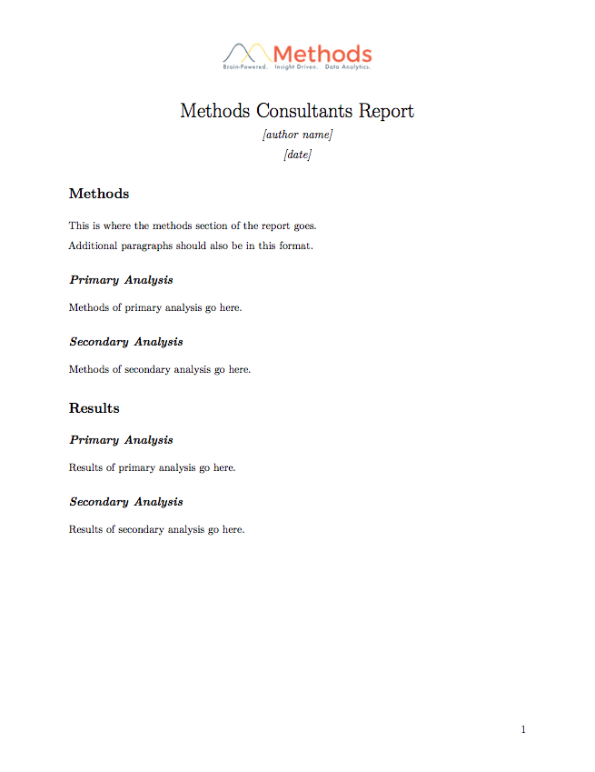
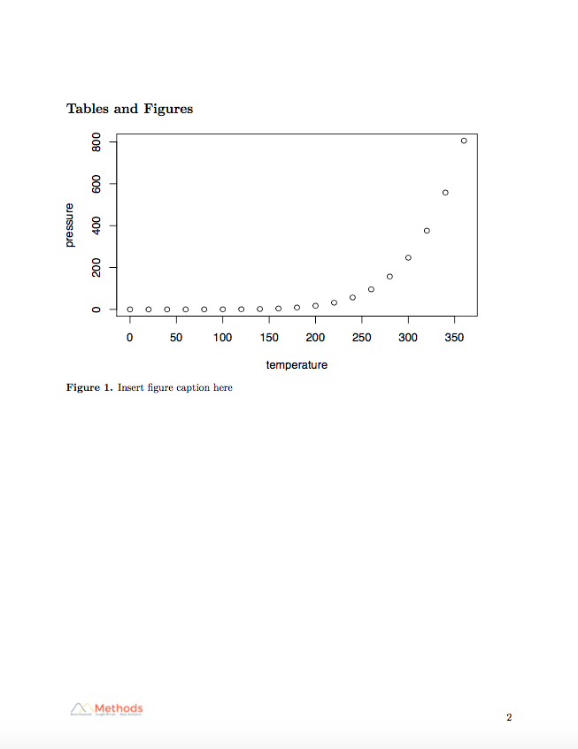

```{r setup, include=FALSE}
knitr::opts_chunk$set(echo = TRUE)
```

[](https://travis-ci.org/MethodsConsultants/mcdocs)

R package of Methods Consultants branded RMarkdown templates

## Installation

To install the `mcdocs` package containing all of the Methods templates, run:

```{r eval = FALSE}
devtools::install_github("MethodsConsultants/mcdocs")
```

- To start a new document or presentation using a Methods template in RStudio:
    1. Create a new RMarkdown document
    2. Navigate to the `From Template` screen on the sidebar
    3. Select which template you would like to use
    4. Create a new directory to store the files associated with the template
    5. Click `OK`

- Current templates in the package: 
    - Methods Consultants Presentation Slides
    - Methods Consultants Xaringan Presentation Slides
    - Methods Consultants Word Document
    - Methods Consultants PDF Report

### Methods Consultants Presentation Slides

- This slide template has the following format for the title slide:
    
    
    
- and non-title slides:

    


### Methods Consultants Xaringan Presentation Slides

- This slide template has the following format for the title slide:
    
    
    
- and non-title slides:

    

    
### Methods Consultants Word Document

- This `.docx` template has the following format for the first page:

    

- and following pages:

    
    
### Methods Consultants PDF Report

- This `.pdf` template has the following format for the first page:

    

- and following pages:

        

